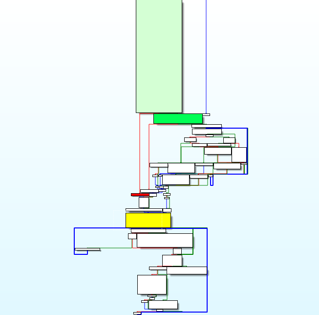

*rusty hammer* was a reverse engineering challenge from Breizh CTF 2022. It's a rust binary, compiled against latest GLIBC (2.34, I had to boot up an up to date archlinux docker to run it...). The challenge states that we're dealing with a ransomware of some sort. It was rather easy, even if it took me hours to figure out stupid things (such as the fact that `open(~/.bash_history)` does not resolves `~` as `$HOME` and that using symmetric encryption is just a way to have an easy decryption of files straight away.)

With a quick look at the code, we quickly notice the encryption function:

```assembly
mov     r9d, 1F4h
mov     rdi, rbx
lea     rsi, [rsp+518h+dest.inner.inner.inner.buf+4]
xor     ecx, ecx
mov     r8, r13
call    _ZN4aead6stream15StreamPrimitive7encrypt17h16920bc93aa8d987E_llvm_9978635755915158318 ; aead::stream::StreamPrimitive::encrypt
mov     r15, qword ptr [rsp+518h+var_508.gap0]
test    r15, r15
jz      short loc_55555555DC20
```

This ransomware is using `aead::stream::StreamPrimitive::encrypt`, which is defined [here](https://docs.rs/aead/0.4.2/aead/stream/trait.StreamPrimitive.html).

Since this crate is an interface intended to be used by encryption algorithms, this does not tells us about the encryption algorithm actually used there. Opening the function gives us the answer:

```assembly
lea     rdi, [rsp+728h+dest] ; dest
lea     rsi, [rsp+728h+var_688] ; src
call    _ZN16chacha20poly13056cipher15Cipher$LT$C$GT$3new17h2d36d85c48f32519E ; chacha20poly1305::cipher::Cipher$LT$C$GT$::new::h2d36d85c48f32519
lea     rdi, [rsp+728h+var_6D0]
lea     rsi, [rsp+728h+dest]
mov     rdx, r15
mov     rcx, r14
mov     r8, rbx
mov     r9, r13
call    _ZN16chacha20poly13056cipher15Cipher$LT$C$GT$25encrypt_in_place_detached17h1e6107fbf3d93744E ; chacha20poly1305::cipher::Cipher$LT$C$GT$::encrypt_in_place_detached::h1e6107fbf3d93744
cmp     [rsp+728h+var_6D0], 1
jz      short loc_555555560D6F
```

We can clearly see that the crate used for encryption is [chacha20poly1305](https://docs.rs/chacha20poly1305/latest/chacha20poly1305/#) (follow the link for usage examples), which is a symmetric encryption algorithm. I repeat : this is a ransomware using a ***symmetric encryption algorithm***.  Plus, the key is sort of hardcoded. 

First thing that came in my mind : let's just put a breakpoint at `chacha20poly1305::new()` to retrieve the key, and one at `encrypt_in_place` to get the nonce.

And that's what I tried. After noticing that this amazing binary got compiled by some of those archlinux people that just love to dynamically compile shits with latests GNUlibc available, so that no one else can run their binaries. *Just took me a while to boot up an up to date archlinux docker, GDB w PEDA or whatever to debug it.*  

So, the challenge starts with a warning :

```
Chiffrement du disque dans 10s !!!                                                   
Chiffrement du disque dans 9s !!!                                                    
Chiffrement du disque dans 8s !!!                                                    
Chiffrement du disque dans 7s !!!                                                    
Chiffrement du disque dans 6s !!!                                                    
Chiffrement du disque dans 5s !!!                                                    
Chiffrement du disque dans 4s !!!                                                    
Chiffrement du disque dans 3s !!!                                                    
Chiffrement du disque dans 2s !!!                                                    
Chiffrement du disque dans 1s !!!                                                
J'espère que tu es sur une VM au moins... 
/
/home
/home/nofix
/home/nofix/Documents
[... file iteration ...]
```

With a quick look at the main function, we can see that it starts with 10 inlined printf & sleeps that prompt this warning.


**After first execution, I did notice that not any encryption had been made on any files**. This is most likely due to a killswitch somewhere.

Kill switch is located right after inline printf & sleeps :

```assembly
;; Used crate is https://doc.rust-lang.org/std/fs/struct.OpenOptions.html
;; It is used like so:
;;
;; let file = OpenOptions::new()
;;            .read(true)
;;            .open("~/.bash_history");

call    cs:_ZN3std2fs4File7options17hcf5c0bb264b89be0E_ptr ; std::fs::File::options::hcf5c0bb264b89be0
mov     qword ptr [rsp+518h+self.__0.custom_flags], rax
mov     qword ptr [rsp+518h+self.__0.read], rdx
lea     rdi, [rsp+518h+self]
mov     esi, 1									; .read(True)
call    cs:_ZN3std2fs11OpenOptions4read17h5d25d7f883cd2e9eE_ptr ; std::fs::OpenOptions::read::h5d25d7f883cd2e9e
lea     rdx, aSrcMainRsBashH+0Bh ; ~/.bash_history string
lea     r14, [rsp+518h+var_508]
;; str length. This is mandatory since rust concatenates all its strings in one big chunk of data.
;; Thus, all strings are accessed with chunk+offset, with n bytes read at this location
mov     ecx, 0Fh                 ; string length
mov     rdi, r14                ; I don't remember what this argument is about
mov     rsi, rax				; self
call    cs:_ZN3std2fs11OpenOptions5_open17h2149c9a9074407c8E_ptr ; std::fs::OpenOptions::_open::h2149c9a9074407c8
cmp     dword ptr [rsp+518h+var_508.gap0], 1 ; checks if open was successfull
jnz     short loc_55555555DA93
```

We can clearly see that a file is getting opened there. Whether this file gets successfully opened or not determines if files will be encrypted or not. 



*On the above picture, light green represents the start of main function with sleeps & printf warnings, green path represent `~/.bash_history` file getting encrypted, the red one represents the second path with no encryption. Eventually both path join up at the yellow block, which is were directory iterator is getting initialized and used.*

From the commentary I've wrote on the code above, we can deduce that this malware tires to open `~/.bash_history` file, and encrypts it if it succeeds opening it.

Funny part is : rust does direct system calls to open files. `~` being a bash notation only, linux OS is not resolving it to `$HOME`, but rather to "folder with the name `~`". This what not intended by the creator, which confessed that he did not test this part of the challenge properly. 

So for the kill switch to be deactivated, we have to created a `~` directory, and place encrypted flag in there under the name `.bash_history`. 

Since this malware is using symmetric encryption, it will decrypt the flag.

```bash
# mkdir ./~
# cp important.enc ./~/.bash_history
# ./target_release_rustyHammer
[... blabla scary encryption thing whatever ...]
# cat ./~/.bash_history
BZHCTF{@MaZ1nG_Ru5t!!}
```

## Side notes

Obviously it was super late, I was tired, and I did forget that symmetric encryption was... symmetric. So I first tried dumping the key and nonce to decrypt the file myself, which actually took me a lot of time for nothing.

Just for the record, the key was `\x00\x01\x02\x03\x04\x05\x06\x07\x08\x09\x0a\x0b\x0c\x0d\x0e\x0f\x10\x11\x12\x13\x14\x15\x16\x17\x18\x19\x1a\x1b\x1c\x1d\x1e\x1f`, and the nonce was `\x00\x00\x00\x00\x01\x02\x03\x04\x05\x06\x07\x08` (not sure for the nonce, but it was very similar).
