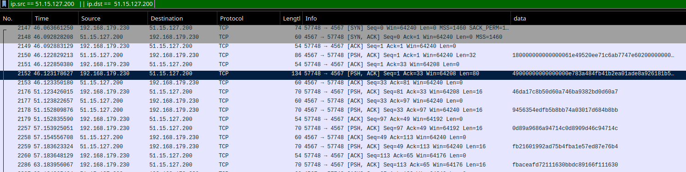

`malware (2/3)` was a reversing challenge from Barbhack 2021. It was made by [Sar](https://twitter.com/sar5430). It is quite straightforward but remains interesting. 

# Context

We are given two files : a pcapng capture of a network traffic and an ELF binary ironically named `svchost`. We have a flag to find, you know the drill. 

Given the fact that we have a pcap and that the challenge is called "malware", I guess that there will be a C2 and data exfiltration.


# Pcap?

Before we dig into the binary, we can take a look at the given pcap.

From the first part of this challenge, malware (1/3), we know that the attacker has the ip `51.15.127.200`, as this is the ip passed as argument to `svchost` to connect to the C2. 

Using this information we can filter communications on the pcap to show communications to this C2 using `ip.src == 51.15.127.200 || ip.dst ==  51.15.127.200` as our filter.



This seems to show relevant informations with data embedded. This sure looks like a communication between local private address and a C2. Informations doesn't seem to be readable in their current state, I guess we'll have to reverse some stuff now.

> We will see that some key exchange will be made, before communication between client and server gets encrypted.

# Digging around

I'm not gonna show up the whole reverse engineering process based on renaming and retyping everything, cause it's boring and no one cares.

The main function immediately shows up interesting stuff : 

```C
void __fastcall __noreturn main(int argc, char **argv, char **a3)
{
  unsigned int do_we_even_care_about_rand; // eax
  char s[2]; // [rsp+10h] [rbp-200h] BYREF
  _BYTE v5[502]; // [rsp+12h] [rbp-1FEh] BYREF
  pthread_t newthread; // [rsp+208h] [rbp-8h] BYREF

  do_we_even_care_about_rand = time(0LL);
  srand(do_we_even_care_about_rand);
  if ( argc == 2 )
    is_client = 1;
  if ( is_client )
    client_routine((__int64)argv[1]); // C2 addr
  pthread_create(&newthread, 0LL, (void *(*)(void *))server_routine, 0LL);
  while ( 1 )
  {
    fgets(s, 500, stdin);
    s[strcspn(s, "\n")] = 0;
    switch ( s[0] )
    {
      case 'l':
        C2_order = 31;
        something_I_dont_care_about_anyway = (__int64)v5;
        break;
      case 'c':
        C2_order = 37;
        something_I_dont_care_about_anyway = (__int64)v5;
        break;
      case 'e':
        C2_order = 42;
        something_I_dont_care_about_anyway = (__int64)v5;
        break;
      default:
        C2_order = 0;
        something_I_dont_care_about_anyway = 0LL;
        break;
    }
  }
}
```

Two informations here : 

- The binary can act as server ***and*** client, which means we have C2 code right inside the bin
- Actions can be taken from `stdin` on client using letters `l`, `c`, and `e`

Digging into the server routine, we find out that some RSA keys are getting generated, with `n` and `e` being sent to the client : 

```C
__int64 gen_send_RSA_keys()
{
  _QWORD *v1; // [rsp+8h] [rbp-8h]

// [...key generation using some random unsecure stuff...]
  printf(
    "n = 0x%lx\np = 0x%lx\ne = 0x%lx\nq = 0x%lx\nd = 0x%lx\n",
    n_rsa_val,
    p_rsa_val,
    e_rsa_val,
    q_rsa_val,
    d_rsa_val);
// [...some code...]
  send_data(msg_containing_e_and_n);
  return 0LL;
}
```

Those keys are received on the client routine initialization : 

```C
void __fastcall __noreturn client_routine(__int64 a1)
{
  int seconds; // [rsp+1Ch] [rbp-14h]
  __int64 msg; // [rsp+20h] [rbp-10h]

  connect_to_server(a1);
  msg = recv_routine();
  n_rsa_val = *(_QWORD *)(msg + 8);
  e_rsa_val = *(_QWORD *)(msg + 16);
  printf("n : %lx, e : %lx\n", n_rsa_val, e_rsa_val);
```

Client then generates 8 keys, cipher them using RSA algorithm we all recognized thanks to `n`, `e`, `p`,` q` `d` keys. 

```C
__int64 gen_encrypt_send_keys()
{
  unsigned __int64 v1; // [rsp+8h] [rbp-18h]
  _QWORD *v2; // [rsp+10h] [rbp-10h]
  int i; // [rsp+18h] [rbp-8h]
  int v4; // [rsp+1Ch] [rbp-4h]

  v4 = 0;
  while ( v4 <= 7 ) // stupid key generation
  {
    HIDWORD(v1) = rand();
    LODWORD(v1) = rand();
    if ( v1 < n_rsa_val )
      keyarr[v4++] = v1;
  }
  /* 
  [...some stuff preparing message to send to the C2...]
  */
  for ( i = 0; i <= 7; ++i )
  {
    *(_QWORD *)((char *)&v2[i + 1] + 1) = keyarr[i];
    printf("KEY%d = %lx\n", (unsigned int)i, keyarr[i]);
  }
  encrypt_keys_with_RSAlike_crypto((char *)v2 + 9, 64LL); // uses e and n parameters received earlier
  send_data(v2);
  encrypt_flag = 1; // flag that states that both client and server init is done, msg can now be encrypted
  return 0LL;
}
```

Those keys will be received by the server, and decrypted using `d` and `n` parameters generated earlier. 

Those keys will be the keys used for future message encryption. 

# Back to the pcap

During reverse engineering process, we can notice that messages aren't encrypted before `encrypt_flag` is set to `1`. Following code shows the start of the routine used to send messages : 

```C
__int64 __fastcall send_data_to_server(__int64 *a1)
{
/* [eluded] */
  v6 = *a1;
  size = (v6 & 0xFFFFFFFFFFFFFFF8LL) + 8;
  ptr = (char *)realloc(a1, size);
  if ( encrypt_flag )
    client_encryption(ptr, size, (unsigned int)key_number); // uses keys generated by the client
  v7 = 0LL;
  while ( size )
  {
    /* [just casualy sending data] */
  }
  ++key_index;
  key_index %= 8;
  free(ptr);
  return 0LL;
}
```

In the above example, data is getting encrypted first is the `encrypt_flag` is set. 

Client *and* server uses both 1 message to setup each other:

```
|cleint                  server| Server is listening
|client ----connects---->server| Client connects

|client<-send rsa keys-- server| First cleartext message
|client -send enc keys-->server| Sends encrypted encryption keys. Server decrypts them using d and n parameters

Cleint / server initialisation is done

|client --encrypted trafic-->server| // traffic is encrypted using keys generated by client
|client<--encrypted trafic-- server|
```


 

# Don't care about all that, I only want to decrypt this network traffic man

Okey it's time to retrieve those keys now. First, we need to understand the protocol to retrieve informations from the first message. Here is the first message (server sending 32 bytes of data to the client) :

`180000000000000061e49520ee71c6ab7747e602000000000000000000000000`

We can notice 2 things here : 

- The length of the message is stored in the first byte of the message
- Messages are probably padded (they always are multiple of 8. It might looks like I'm finding this information like magic, but I only reversed the function responsible for creating messages to be sent between client and server, and it craft messages as blocks of 8 bits).

## Protocol

After a bit of reversing, we can deduce structs for communication between server and client. 

Messages are sent using this struct:

```C
struct msg
{
  _QWORD size;
  unsigned __int8 order; // used to determine what operation server/client is doing
  _BYTE data[];
};
```

However, the very first message sent by the server does not contain `order` field.

```C
struct first_msg
{
  _QWORD size;
  _BYTE data[];
};
```

As we mentioned earlier, first message is just the server sending `e` and `n` keys to the client so that it can generate encryption keys that will be used to encrypt later messages. 

## First message

Message decomposed as such :

```
0000000000000018 -> len
abc671ee2095e461 -> n
0000000002e64777 -> e
0000000000000000 -> 0 padding to reach 24 bytes of data defined by len param
```

Btw, `n` has known factors on `factordb`, so we also known `d` , `p`, and `q`:

```
d = 0x4ffee7e66677ea13
p = 0xc6816a67
q = 0xdd870df7
```


## Second message

After receiving `n` and `e`, the client generates encryption keys that will be used for encrypting/decrypting messages. Those keys are getting encrypted using `e` and `n`, with some RSA-like (or I don't really know which) algorithm, and are sent to the server.

Thus, the second message contains encrypted keys. The second message is the following : `49000000000000000e783a484fb41b2ea01ade8a926181b514c078b35ef6cc1236baabcba0c25e836036436cf83ab2f1a47499fbcefadb7922cb1084bd540f9167979ed14dea187a9800000000000000`

Which translate as :

```
0000000000000049 -> len
0e				 -> Order
a02e1bb44f483a78 -> Encrypted Key0
14b58161928ade1a -> Encrypted Key1
3612ccf65eb378c0 -> Encrypted Key2
60835ec2a0cbabba -> Encrypted Key3
a4f1b23af86c4336 -> Encrypted Key4
2279dbfacefb9974 -> Encrypted Key5
67910f54bd8410cb -> Encrypted Key6
987a18ea4dd19e97 -> Encrypted Key7
0000000000000000 -> Padding again (order field is forcing a new block of 8 bytes)
```

Those keys are getting decrypted using `d` and `n` on server side :

```c
  switch ( order_from_c2 )
  {
    case 0xEu:
      decrypt_keys_on_server_side((__int64 *)ptr->data, 0x40uLL);
      memcpy(keyarr, ptr->data, 0x40uLL);
      for ( i = 0; (int)i <= 7; ++i )
        printf("KEY%d = %lx\n", i, keyarr[i]);
      encrypt_flag = 1; // all communications will be encrypted using keys now
      break;
    case 0x13u:
```

We can use a little python script to decrypt the key with `d` key  we found thanks to `factordb`:

```python
keys = [
0xa02e1bb44f483a78,
0x14b58161928ade1a,
0x3612ccf65eb378c0,
0x60835ec2a0cbabba,
0xa4f1b23af86c4336,
0x2279dbfacefb9974,
0x67910f54bd8410cb,
0x987a18ea4dd19e97 ,
]
n = 12377705893437236321
e = 48646007
d = 0x4ffee7e66677ea13
p = 0xc6816a67
q = 0xdd870df7
for k in keys:
    print(hex(pow(k,d,n)), end=",\n")

```

 Which outputs : 

```python
0x1feb446f78bcd857,
0x4ac8ce480ef59181,
0x4f4269ac495ab072,
0x7efafb73088f10f5,
0x59d6b8a60b08a3bf,
0x4549226a40f34852,
0x56c351fd1bbea176,
0x3281930518033e20
```

8 keys are used for communication. The key used to encrypt a message is defined by a counter named `keyidx` that increments after each successfully sent message.  As I don't want to bother with the counter, and because there are only 8 keys, I will be bruteforcing every messages on the decryption part, later on in this WU.

## Rest of communication

From now on, all communication between the client and the server will be encrypted using those keys, as we can see in the `recv_routine` for example:

````C
void *recv_routine()
{
  size_t v0; // rax
  char src[2008]; // [rsp+0h] [rbp-800h] BYREF
  size_t buf; // [rsp+7D8h] [rbp-28h] BYREF
  size_t n; // [rsp+7E0h] [rbp-20h]
  void *s; // [rsp+7E8h] [rbp-18h]
  size_t size; // [rsp+7F0h] [rbp-10h]
  int v7; // [rsp+7FCh] [rbp-4h]

  buf = 0LL;
  recv(fd, &buf, 8uLL, 0); // recv size of message first
  if ( encrypt_flag ) // decrypting first blob to recover size
    decrypt_info(&buf, 8uLL, key_index);
  size = (buf & 0xFFFFFFFFFFFFFFF8LL) + 8;
  s = malloc(size);
  memset(s, 0, size);
  *(_QWORD *)s = buf;
  buf = size - 8;
  v7 = 8;
  while ( buf )
  {
    v0 = buf;
    if ( buf > 0x7D0 )
      v0 = 2000LL;
    n = v0;
    n = recv(fd, src, v0, 0);
    memcpy((char *)s + v7, src, n);
    buf -= n;
    v7 += n;
  }
  if ( encrypt_flag ) // decrypting rest of info
    decrypt_info((char *)s + 8, size - 8, dword_406200);
  ++key_index;
  key_index %= 8;
  return s;
}
````

Here is the algorithm used in `decrypt_info` : 

```C
__int64 __fastcall decrypt_info(void *data, unsigned __int64 size_of_data, int keyidx)
{
/* [eluded for brievty] */
  v5 = keyarr[keyidx];
  for ( i = 0; size_of_data > i; i += 8 )
  {
    v9 = *(_QWORD *)((char *)data + i);
    for ( j = 0; j <= 3; ++j )
    {
      v3 = sub_40137F(v9, 12LL);
      v10 = (((v5 ^ sub_401362(v5 ^ v3, 39LL)) - 0x318904A2B5CDE680LL) ^ 0x146739AB2C8DE0F5LL) + 0x4E89C0AB67D25150LL;
      v7 = 0LL;
      for ( k = 0; k <= 7; ++k )
        v7 |= (unsigned __int64)(unsigned __int8)sbox_decrypt[(unsigned __int8)(v10 >> (8 * (unsigned __int8)k))] << (8 * (unsigned __int8)k);
      v9 = v5 ^ sub_40137F(v5 ^ v7, 17LL);
    }
    *(_QWORD *)((char *)data + i) = v9;
  }
  return 0LL;
}
```

The algorithm isn't that complicated, but we wont be reimplementing it in C, because this might be the cause of loss of time and debugging, which we can avoid.

## What are we looking for now?

Looking at the client routine, we can see which orders the C2 can send to it's client : 

```C
  switch ( order_from_c2 )
  {
    case 37:
      filename = ptr->data;
      stream = fopen(ptr->data, "r");
      printf("DO_CAT: %s\n", ptr->data);
      if ( stream && !fseek(stream, 0LL, 2) )
      {
        /* [reading a file and sending it] */
      }
      break;
    case 31:
      name = ptr->data;
      dirp = opendir(ptr->data);
      printf("DO_LIST : %s\n", ptr->data);
      if ( dirp )
      {
        /* [listing files in directory] */
      }
      break;
    case 42:
      command = ptr->data;
      printf("DO_EXEC: %s\n", ptr->data);
      system(ptr->data);
      strcpy(src, "exec done");
		/* [exec with a system command] */
      break;
  }
```

I have no doubt that the C2 simply ask for the flag to be read. We can expect the flag to be in clear text inside the pcap capture once decrypted. Now, we just need to decrypt the whole traffic and search for ASCII values.

# Decrypting everything

As mentioned earlier, we need decrypted keys to decrypt network traffic. We already decrypted those keys earlier when we talked about `factordb`.

Now to decrypt the traffic, we can do better than re-writing the algorithm to decrypt datas. We already have a server that can decrypt sent datas if its given the right decryption keys. We just need to force the decryption keys in memory, and submit encrypted blocks to have a fully working decryption process. To do that, we first need to recover blocks to decrypt.

To extract them from the pcap, we use tshark : 

```bash
tshark -r capture.pcapng -Tfields -e data.data -Y "ip.src == 192.168.179.230 && ip.dst == 51.15.127.200 && data.data" | tail -n +2 > datas.txt 
```


We use `tail -n +2` to remove 2 first communications that are `n`, `e` and encryption key exchange. 

The following script will split the data in block of 8 bytes and print them in little endian. It will also prefix every print by `x[{}] = 0x`, because this is the only way to initialize a slice using IDC, the scripting language of IDA we will be using in a minute. (yes, IDC, not IDAPython, I only had IDA demo at the time, sorry for the huge ugly script it will generate). 

```C
import binascii
with open("datas.txt") as f:
    lines = f.readlines()

index = 0
for line in lines :
    line = line[:-1]
    datas = [line[i:i+16] for i in range(0, len(line), 16)]
    for data in datas:
        print("x[{}] = 0x{};".format(index, binascii.hexlify(struct.pack("<Q", int(data,16))).decode()), end=" ") # big to little endian
        index += 1
print("\nNumber of elements : {}".format(index))
```

We will use IDA's `APIcall` API to directly call decryption function with proper arguments while debugging. 

The following script will decrypt every block of data and print them if they are full ASCII.

The script :

- Hard code right key values in memory for decryption (also hardcore `e`,`d`,`n`,`p`, and `q`, but they should not be required anyway)
- Iterates over encrypted blocks
- Calls decryption function of the server for each block, using all the keys
- Prints decrypted block if the result of the decryption is a fully ASCII text

Start a debug session, `file->script command` and paste the following :

```C

static is_ascii(addr, size){
	auto i;
    for(i = 0; i < size; i++){
        auto b = get_wide_byte(addr+i);
        if((b >= 0x7F || b <= 0x20) && b != 0x0A && b != 0x00) return 0;
    }
    return 1;
}
static print_little_endian_ascii(addr, size){
   	auto i;
    for(i = 0; i < size; i++){
        msg("%c", get_wide_byte(addr+i));
    }
}
static main() {
    auto x = object(); // encrypted blocks
    x[0] = 0xa7600db5c817da46; x[1] = 0xa7600dbd8293ba46; x[2] = 0x4c71946a68a9890d; x[3] = 0x4c71946cd409890d; x[4] = 0x30161172fdeaacfb; x[5] = 0x3016116f1689dcbb; x[6] = 0x47080a59b5769e0a; x[7] = 0xc80c914e75df4b54; x[8] = 0x47080a4aa14ce8aa; x[9] = 0x287ceb3869b22b1c; x[10] = 0x86cb0306ea15d010; x[11] = 0xa7600993f2f27a46; x[12] = 0x93a5d75bc2519678; x[13] = 0x56ab1d53189b5b14; x[14] = 0xbbb88e8e8b5ba074; x[15] = 0xa931e2ded613f694; x[16] = 0x4c71946cd409890d; x[17] = 0x8e661bf6f7192045; x[18] = 0x4e67970f5ce254ae; x[19] = 0xb4767edca88a61fb; x[20] = 0x1796428aa3291775; x[21] = 0x50023c9b3ca17de9; x[22] = 0x3016117de19f2cfb; x[23] = 0x155aeafc0e254766; x[24] = 0x592ee3cc27dce612; x[25] = 0x161602ca5d2ebbaf; x[26] = 0xac58529a843b4745; x[27] = 0xa8d0731fb62a9627; x[28] = 0x47080a50c14ce8aa; x[29] = 0x740fd6306a571cc7; x[30] = 0x813b472050417393; x[31] = 0x287cdf52c96f6b1c; x[32] = 0xa18b291106a56c22; x[33] = 0x44b61dd6c30fb029; x[34] = 0xa7600dbd8293ba46; x[35] = 0x5829f75339c9c83d; x[36] = 0x6ef6b50cb66fcbc2; x[37] = 0xbba43a05ed33f694; x[38] = 0xc85e3e91f6138203; x[39] = 0x4c719a345dcde90d; x[40] = 0x6f73cc31fd1902d4; x[41] = 0xa5307eff2fd6acf6; x[42] = 0xb4767ec5afa5a1fb; x[43] = 0xd7964289b04d2b04; x[44] = 0xf790b5c00cc62980; x[45] = 0x30164ad5204aacfb; x[46] = 0x465e8c0e192d8b3b; x[47] = 0x919b7da4ba9d85c3; x[48] = 0x16162ab1ee53296f; x[49] = 0x56954a1186dd8de7; x[50] = 0x39c0e4455fa1d6ae; x[51] = 0x47080a50d7b69e0a; x[52] = 0x38b2389a7972cc32; x[53] = 0x9bae1bfce6185095; x[54] = 0x287cdf52c96f6b1c; x[55] = 0xb716640ea31a2d0f; x[56] = 0x8b934aae26fefcfd; x[57] = 0xa7600dac02f7da46; x[58] = 0xa7f3a4a8d8927a46; x[59] = 0xbba46116d8cab694; x[60] = 0x8ac693c936138e3a; x[61] = 0x6644d5c039766ece; x[62] = 0x4c71946cc12de90d; x[63] = 0x095ad469b74d87ba; x[64] = 0xbaac930a6706534b; x[65] = 0xb475a3e5bee5a1fb; x[66] = 0x18a4b7b19d0b1636; x[67] = 0x51dbe5a3089a69d7; x[68] = 0x30161172fdeaacfb; x[69] = 0x3016116f1689dcbb; x[70] = 0x47080a4d55769e0a; x[71] = 0x470bdd03d7b69e0a; x[72] = 0xa7600dbd8293ba46; x[73] = 0xbfbf1d45a1c9453e; x[74] = 0xa76006a616f3ba46; x[75] = 0xbbb8b5df4e355694; x[76] = 0xbba4611e6113f694; x[77] = 0xb475ad92196021fb; x[78] = 0xb475a3fe8117c09b; x[79] = 0x161628ee24941baf; x[80] = 0x161602ca5d2ebbaf; x[81] = 0x287ceb280579b3fc; x[82] = 0xd27997828ab94b1c; x[83] = 0xa7600993f2f27a46; x[84] = 0x279cac7de2d0e699; x[85] = 0xa7600dacb893ba46; x[86] = 0xbba4611e6113f694; x[87] = 0xc430cd0c9cad95c6; x[88] = 0x11314bf5d82c8a6f; x[89] = 0x4c719a2a3220e90d; x[90] = 0x4c716b91e167290d; x[91] = 0xb475ad92196021fb; x[92] = 0xb475a3fe8117c09b; x[93] = 0x161628ee24941baf; x[94] = 0x161602ca5d2ebbaf; x[95] = 0x287ceb280579b3fc; x[96] = 0xd27997828ab94b1c; x[97] = 0xa7600dac02f7da46; x[98] = 0xa7f3a4a8d8927a46; x[99] = 0xbbb8b5df4e355694; x[100] = 0xbba4611e6113f694; x[101] = 0xb475ad92196021fb; x[102] = 0xb475a3fe8117c09b; x[103] = 0x16162ab1ee53296f; x[104] = 0x79b38a3cd6fdbf86; x[105] = 0x161629a90a6ebbaf; x[106] = 0x47080a47c2629e0a; x[107] = 0x4714fa59ed3b08aa; x[108] = 0x287ceb209805bb5c; x[109] = 0x286ecb828ab94b1c; x[110] = 0xa7600db5c817da46; x[111] = 0xa7600dbd8293ba46; x[112] = 0x4c71946a68a9890d; x[113] = 0x4c71946cd409890d; x[114] = 0x19709dcde429dcbb; x[115] = 0x94becf193d5f2cc4; x[116] = 0x161602c808b3296f; x[117] = 0xc41127c4c2f6a225; x[118] = 0x5f8865fee7f34f2a; x[119] = 0x5f837ac4cb06e3ef; x[120] = 0x1616556484941baf; x[121] = 0x470bdd081a2ce8aa; x[122] = 0x4712273c95db08aa; x[123] = 0x287cdf5af2cf6b1c; x[124] = 0x287cdf4c63522b1c; x[125] = 0xbbb8b5df4e355694; x[126] = 0xbba4611e6113f694; x[127] = 0xb475ad92196021fb; x[128] = 0xb475a3fe8117c09b; x[129] = 0x161628ee24941baf; x[130] = 0x161602ca5d2ebbaf; x[131] = 0x287cdf5af2cf6b1c; x[132] = 0x287cdf4c63522b1c; x[133] = 0xbbb8b5df4e355694; x[134] = 0xbba4611e6113f694; x[135] = 0xb475ad92196021fb; x[136] = 0xb475a3fe8117c09b; x[137] = 0x16162aac0f7be96f; x[138] = 0x63f1b18760d366da; x[139] = 0x8bf2dcf2078f212a; x[140] = 0x6c169997fef2a224; x[141] = 0xd68ac88eaabc7055; x[142] = 0x47080a4d55769e0a; x[143] = 0x470bdd03d7b69e0a; x[144] = 0xa7600db5c817da46; x[145] = 0xa7600dbd8293ba46; x[146] = 0x4c71946a68a9890d; x[147] = 0x4c71946cd409890d; 
    auto key_arr_addr = 0x004061C0; // memory address with empty space while debugging
    patch_qword(key_arr_addr,     0x1feb446f78bcd857); // patching key
    patch_qword(key_arr_addr+8,   0x4ac8ce480ef59181);
    patch_qword(key_arr_addr+8*2, 0x4f4269ac495ab072);
    patch_qword(key_arr_addr+8*3, 0x7efafb73088f10f5);
    patch_qword(key_arr_addr+8*4, 0x59d6b8a60b08a3bf);
    patch_qword(key_arr_addr+8*5, 0x4549226a40f34852);
    patch_qword(key_arr_addr+8*6, 0x56c351fd1bbea176);
    patch_qword(key_arr_addr+8*7, 0x3281930518033e20);

    patch_qword(0x406198, 0xabc671ee2095e461); // patching n,e,d,p,q
    patch_qword(0x4061A0, 0xc6816a67);         
    patch_qword(0x4061A8, 0xdd870df7);
    patch_qword(0x4061B0, 0x4ffee7e66677ea13);
    patch_qword(0x406150, 0x2e64777);
    auto i;
    auto number_of_qwords = 148;
    for(i = 0 ; i < number_of_qwords; i++){ // for each encrypted block
        auto keyidx;
        auto placeholder = 0x7F630D844550; // somewhere with empty space to write a QWORD
        for(keyidx = 0; keyidx < 8; keyidx++){    // bruteforcing with every key
            auto size = 8;
            auto info_to_wr = x[i]; // block to decrypt
            patch_qword(placeholder, info_to_wr);
	    // we can do a direct call to the function I renamed decrypt_info while debugging
	    // thx to IDA's APPcall (see https://hex-rays.com/blog/practical-appcall-examples/)
            decrypt_info(placeholder, size, keyidx);
            if(is_ascii(placeholder, 8)){
                print_little_endian_ascii(placeholder, 8);
            }
        }
    }
    msg("Done\n");
}
```

This script outputs the flag : 

```C
istoryNne*$=PZAD&ts#portant_secret.txt'%brb{pretty_b4d_r4t_my_fri3nd}
Done
```

**Flag : brb{pretty_b4d_r4t_my_fri3nd}**


**Nofix -**
